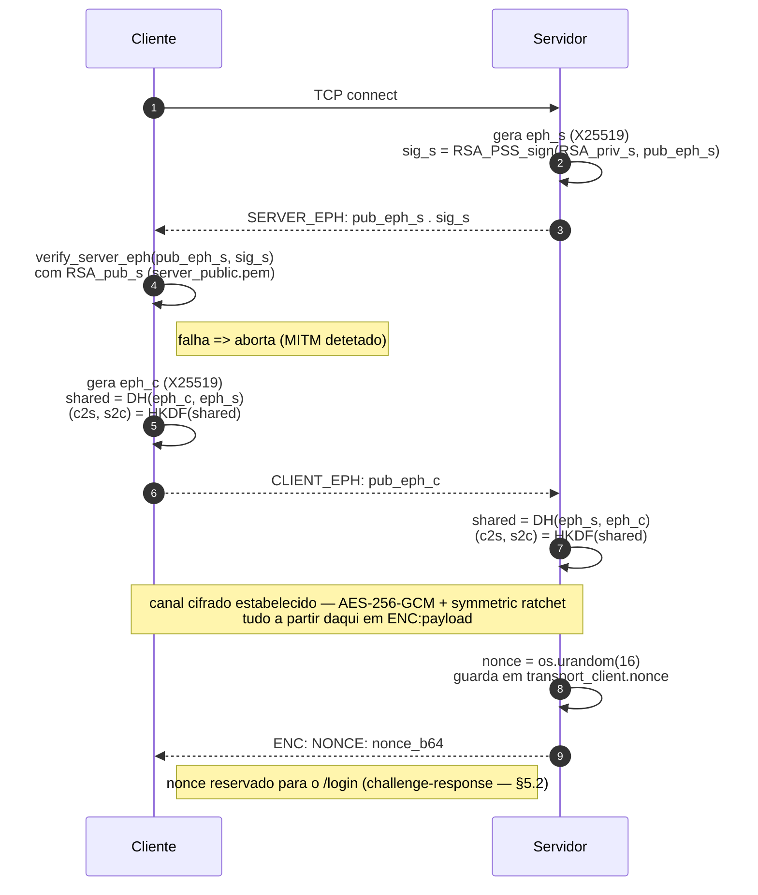
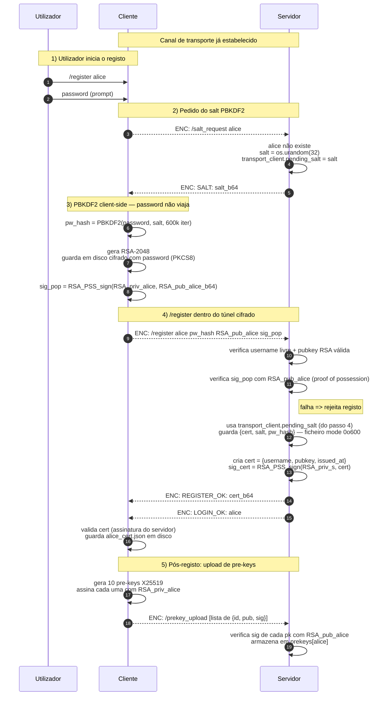
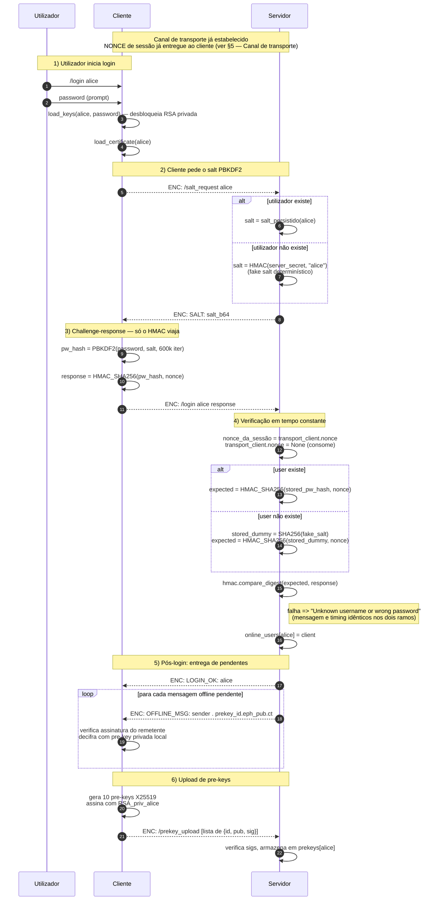
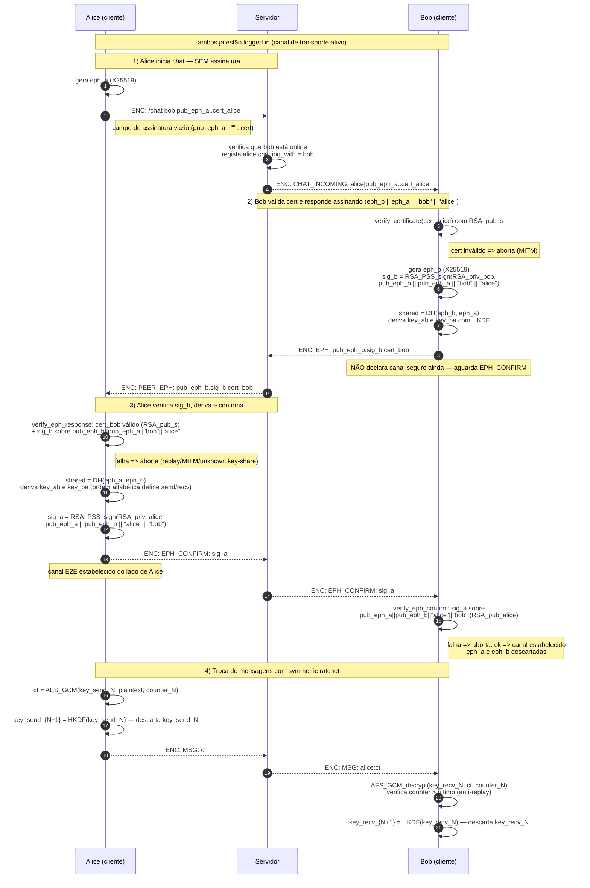
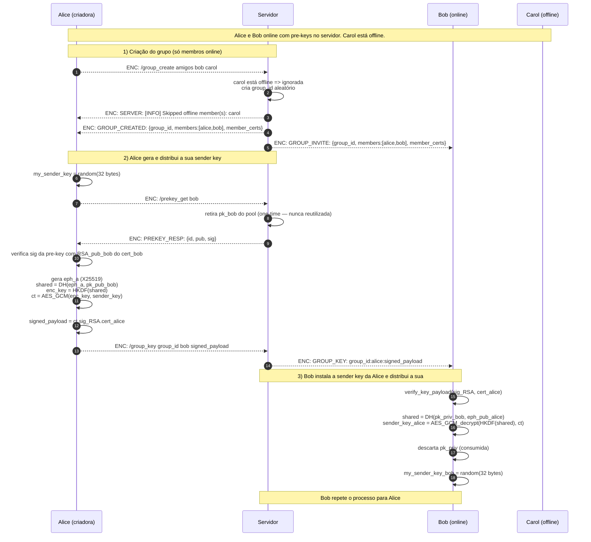
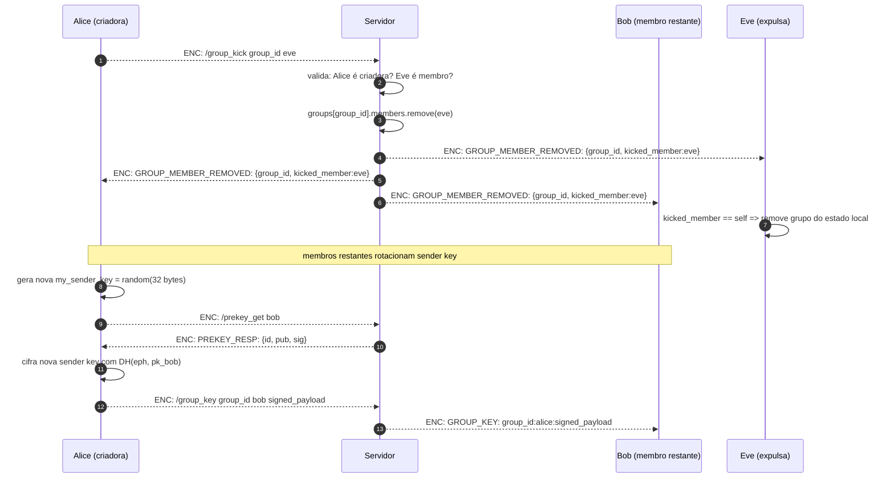
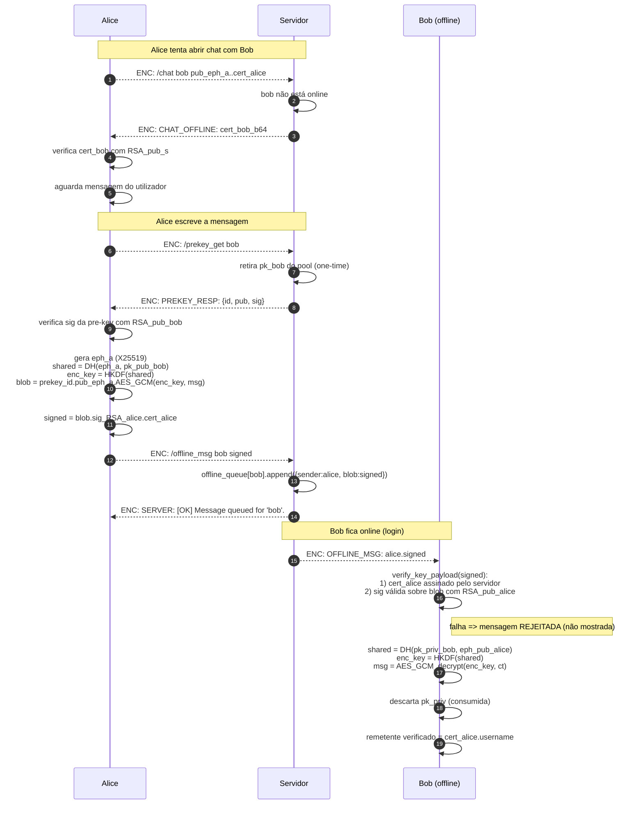

# SignalUM — Sistema de Conversação Seguro

## Grade

**Final Grade:** 18.5 / 20 ⭐

---

## Índice

1. [Introdução](#1-introdução)
2. [Arquitetura](#2-arquitetura)
   - [Estrutura do projeto](#estrutura-do-projeto)
   - [Módulos principais](#módulos-principais)
3. [Como correr](#3-como-correr)
4. [Funcionalidades implementadas](#4-funcionalidades-implementadas)
5. [Protocolo e fluxos de comunicação](#5-protocolo-e-fluxos-de-comunicação)
   - [Canal de transporte](#canal-de-transporte-server_eph--client_eph)
   - [Registo](#51-registo-register)
   - [Login](#52-login-login)
   - [Chat 1-a-1](#53-chat-1-a-1-chat--handshake-sts--symmetric-ratchet)
   - [Grupos](#54-grupos-group_create-group_add-group_kick)
   - [Mensagens offline](#55-mensagens-offline-offline_msg)
6. [Gestão de chaves e primitivas criptográficas](#6-gestão-de-chaves-e-primitivas-criptográficas)
7. [Modelo de segurança](#7-modelo-de-segurança)
8. [Valorizações](#8-valorizações)
9. [Ataques simulados](#9-ataques-simulados)

---

## 1. Introdução

O **SignalUM** é um sistema de conversação seguro desenvolvido no âmbito da unidade curricular de Segurança de Sistemas Informáticos da Universidade do Minho. O objetivo do projeto é implementar um sistema de chat com End-to-End Encryption (E2EE), garantindo que o conteúdo das comunicações permanece inacessível a terceiros, incluindo o servidor que intermedeia o serviço.

O sistema segue uma arquitetura cliente-servidor sobre TCP, onde o servidor atua como intermediário de encaminhamento mas nunca tem acesso ao conteúdo das mensagens. O modelo de ameaça assume um servidor *honest-but-curious* (confiável para efeitos de integridade e gestão de identidades, mas não para confidencialidade) e um adversário de rede capaz de realizar ataques man-in-the-middle ativos.

O design criptográfico é inspirado no protocolo Signal, adotando chaves efémeras X25519 para forward secrecy, handshakes Station-to-Station (STS) para autenticação mútua entre clientes, e AES-256-GCM com contador anti-replay para cifra de mensagens. O servidor atua adicionalmente como Autoridade de Certificação, emitindo certificados RSA-PSS que servem como âncora de confiança para a autenticação de utilizadores.

A implementação foi feita em Python com `asyncio` para concorrência, utilizando exclusivamente a biblioteca `cryptography` para todas as primitivas criptográficas.

---

## 2. Arquitetura

O SignalUM é um sistema de chat seguro com arquitetura cliente-servidor, onde o servidor atua como intermediário de encaminhamento mas **nunca tem acesso ao conteúdo das mensagens**. Toda a lógica criptográfica reside nos clientes.

A comunicação entre cliente e servidor é feita por TCP com `asyncio`, e todas as mensagens seguem o formato de protocolo `TIPO:payload\n`, centralizado em `protocol.py`.

### Estrutura do projeto

```
src/
├── client/
│   ├── client.py        # ponto de entrada; estabelece ligação TCP e corre os loops asyncio
│   ├── handlers.py      # dispatch de mensagens recebidas e comandos do utilizador
│   ├── encryption.py    # SecurityManager — toda a lógica criptográfica do cliente
│   ├── state.py         # ClientState — estado de runtime (sessão, grupos, filas asyncio)
│   ├── persistence.py   # I/O de disco: chaves RSA, certificados, prekey store
│   └── ui.py            # prompt contextual e funções de output no terminal
├── server/
│   ├── server.py        # ponto de entrada; handshake de transporte e loop principal
│   ├── handlers.py      # lógica de negócio: registo, chat, grupos, mensagens offline
│   ├── state.py         # estado de runtime do servidor (utilizadores online, grupos, filas)
│   └── persistence.py   # persistência: users.json, prekeys.json, chaves RSA do servidor
├── attacks/
│   ├── eavesdrop.py     # proxy passivo: regista todo o tráfego sem o alterar
│   ├── mitm.py          # proxy que substitui chaves efémeras (demonstração de detecção)
│   └── replay_attack.py # proxy que reenvia mensagens capturadas (demonstração de detecção)
├── crypto_transport.py  # primitivas criptográficas partilhadas: RSA-PSS, X25519, AES-GCM, HKDF
└── protocol.py          # constantes do protocolo: tipos de mensagem (Msg) e comandos (Cmd)
```

### Módulos principais

- **`crypto_transport.py`** — fonte única de todas as primitivas criptográficas do sistema (assinatura RSA-PSS, geração e serialização de chaves X25519, derivação HKDF, cifra/decifra AES-GCM com contador anti-replay). Tanto o cliente como o servidor importam exclusivamente deste módulo, evitando duplicação de lógica criptográfica.
- **`SecurityManager`** (`client/encryption.py`) — encapsula toda a criptografia do lado do cliente: gestão do par RSA de identidade, handshakes STS com peers, sessão de transporte com o servidor, cifra/decifra de mensagens P2P e de grupo, e operações sobre pre-keys.
- **`protocol.py`** — centraliza todas as constantes de protocolo em duas classes: `Msg` para tipos de mensagem e `Cmd` para comandos.

---

## 3. Como correr

### Dependências

- Python 3.10+
- Biblioteca `cryptography`: `pip install cryptography`

### Arranque

```bash
# 1. Iniciar o servidor (porta 8888 por omissão)
python3 src/server/server.py

# 2. Iniciar um cliente CLI (numa janela separada)
python3 src/client/client.py          # porta 8888 por omissão
python3 src/client/client.py 8888     # porta explícita
```

No cliente, autenticar com `/register <username>` (primeiro uso) ou `/login <username>`. A password é pedida de forma interativa; a chave privada RSA nunca sai do cliente.

### Endpoints por omissão

| Entidade | Endereço |
|----------|----------|
| Servidor | `127.0.0.1:8888` |
| Proxies de ataque | `:9999` → relay para `:8888` |

### Simulação de ataques (opcional)

Com o servidor a correr, ligar o cliente a `:9999` em vez de `:8888`:

```bash
python3 src/attacks/eavesdrop.py      # proxy passivo — regista tráfego
python3 src/attacks/mitm.py           # substitui chaves efémeras (detetado)
python3 src/attacks/replay_attack.py  # reenvia mensagens capturadas (rejeitadas)
```

---

## 4. Funcionalidades implementadas

### Canal de transporte (`SERVER_EPH` / `CLIENT_EPH`)

Estabelece-se um canal seguro imediatamente após a ligação TCP entre cliente e servidor. Este canal protege toda a comunicação subsequente através de encriptação end-to-end baseada em chaves efémeras.

### Registo (`/register`)

O utilizador cria uma conta fornecendo um nome de utilizador e password. O cliente gera localmente material criptográfico de identidade (ver §5.1). O servidor valida a posse da identidade, regista o utilizador e emite um certificado que será usado para autenticação entre clientes.

### Autenticação (`/login`)

O utilizador autentica-se junto do servidor com a sua password. A autenticação é feita por *challenge-response* (ver §5.2). Após validação, o cliente recupera o seu estado criptográfico local e fica apto a participar em comunicações seguras com outros utilizadores.

### Chat 1-a-1 (`/chat`)

Dois utilizadores estabelecem um canal de comunicação direto e seguro através de um protocolo de troca de chaves entre clientes. O servidor apenas encaminha mensagens, sem acesso ao conteúdo, sendo a comunicação protegida por encriptação end-to-end.

### Grupos (`/group_create`, `/group`, `/group_add`, `/group_kick`)

O sistema suporta criação e gestão de grupos dinâmicos. A segurança das comunicações em grupo é garantida através de chaves partilhadas entre membros, distribuídas de forma segura. A remoção de membros obriga à atualização das chaves de grupo para preservar a confidencialidade futura.

### Mensagens offline (`/offline_msg`)

O sistema permite envio de mensagens a utilizadores offline. As mensagens são armazenadas de forma cifrada no servidor e apenas podem ser acedidas pelo destinatário quando este volta a estar online.

### Pre-keys (`/prekey_upload`, `/prekey_get`)

Os clientes mantêm um conjunto de chaves temporárias que permitem iniciar comunicações seguras mesmo quando estão offline. Estas chaves são consumidas após utilização, garantindo propriedades de segurança adicionais como forward secrecy em comunicações assíncronas.

### Utilitários

- `/list` — mostra utilizadores atualmente online
- `/group_list` — lista os grupos do utilizador
- `/exit` — sai da sessão atual (chat ou grupo)
- `/quit` — termina a ligação ao servidor

---

## 5. Protocolo e fluxos de comunicação

Todas as mensagens trocadas entre cliente e servidor seguem o formato `TIPO:payload\n`. O handshake de transporte (`SERVER_EPH` → `CLIENT_EPH`) é executado imediatamente após a ligação TCP, antes de qualquer interação do utilizador: apenas estas duas mensagens circulam em claro. A partir do momento em que as chaves de sessão são derivadas, toda a comunicação é encapsulada em `ENC:payload`, onde o payload é cifrado com AES-256-GCM com contador monotónico anti-replay. Logo após o handshake, e já dentro do canal cifrado, o servidor emite um `NONCE` de 16 bytes que será consumido no `/login` para o challenge-response (ver [§5.2](#52-login-login)). Os tipos de mensagem e comandos estão centralizados em `protocol.py`, nas classes `Msg` e `Cmd`.

### Canal de transporte (`SERVER_EPH` / `CLIENT_EPH`)

Imediatamente após a ligação TCP — antes de qualquer interação do utilizador — cliente e servidor executam um handshake DH efémero X25519 que estabelece um canal de transporte cifrado.

As chaves derivadas pelo HKDF são separadas por direção (`c2s` e `s2c`) para evitar colisões de nonce entre direções de comunicação, e avançadas a cada mensagem via symmetric ratchet (ver [§5.3](#53-chat-1-a-1-chat--handshake-sts--symmetric-ratchet) para a descrição completa do mecanismo).



| Passo | Garantia | Razão |
|-------|----------|-------|
| 3–4 | **Servidor autêntico** | `sig_s` verificada com `RSA_pub_s`. MITM que substitua `eph_s` é detetado imediatamente. |
| 5–7 | **Forward secrecy do canal** | `c2s`/`s2c` derivam de efémeras desta sessão; comprometer chaves RSA estáticas no futuro não decifra esta sessão. |
| 9–10 | **Nonce de sessão único** | Gerado dentro do canal cifrado e nunca exposto; consumido a cada tentativa de `/login` (sucesso ou falha) — uma só tentativa por sessão. |
| Todas | **Forward secrecy retroativa por mensagem** | Symmetric ratchet (ver §5.3). |

### 5.1. Registo (`/register`)

O utilizador digita `/register`: o cliente começa por pedir ao servidor o `salt` PBKDF2 que será usado para esta conta (`/salt_request`). O servidor gera um salt aleatório de 32 bytes, guarda-o em `transport_client.pending_salt` (para o associar ao `/register` que se segue na mesma ligação) e devolve-o. O cliente computa **localmente** `PBKDF2(password, salt, 600k)` — a password nunca atravessa a rede em qualquer forma. Em seguida o cliente gera um par RSA-2048, assina a sua chave pública com a chave privada (*proof of possession*) e envia ao servidor o hash da password, a chave pública e a assinatura dentro do canal de transporte. O servidor verifica a prova de posse, guarda `{cert, salt, pw_hash}` e emite um certificado RSA-PSS que serve como âncora de confiança para todos os fluxos E2EE subsequentes.



| Passo | Garantia | Razão |
|-------|----------|-------|
| 4–6 | **Password nunca atravessa a rede** | PBKDF2 calculado no cliente; só o hash de 32 bytes chega ao servidor (ver §6 — PBKDF2). |
| 4–5 | **Salt server-side, ligado à conexão** | Servidor escolhe e armazena o salt antes de o entregar, eliminando dependência da qualidade do RNG do cliente. A associação à conexão impede que um cliente envie um `/register` com um salt diferente do issued. |
| 8 | **Proof of possession da chave RSA** | `sig_pop` sobre a própria pubkey prova posse da chave privada — o servidor não emite cert a quem não controle o par RSA. |
| 12 | **Certificado autêntico** | Assinado pelo servidor com RSA-PSS; clientes verificam com `server_public.pem`. |
| 17 | **Pre-keys autenticadas** | Cada pre-key é assinada por `RSA_priv_alice`; servidor e futuros destinatários verificam com `RSA_pub_alice` do certificado. |

### 5.2. Login (`/login`)

O login é um **challenge-response**: a password (e o seu hash) **nunca atravessam a rede**. Logo após o handshake de transporte, o servidor emitiu já um `nonce` aleatório de 16 bytes (passo 9–10 do diagrama em §5 — Canal de transporte). Quando o utilizador digita `/login`, o cliente desbloqueia a chave RSA privada em disco, pede ao servidor o salt do utilizador, computa localmente `pw_hash = PBKDF2(password, salt)` e envia ao servidor a resposta ao desafio `response = HMAC-SHA256(pw_hash, nonce)`. O servidor calcula `expected = HMAC-SHA256(stored_pw_hash, nonce)` e compara em tempo constante. O nonce é consumido em cada tentativa — uma só tentativa por sessão.

**Anti-enumeração de utilizadores:** se o `salt_request` for feito para um username inexistente, o servidor devolve um *fake salt* determinístico (`HMAC(server_secret, username)` com um segredo derivado da chave RSA privada do servidor) com a mesma forma e tamanho de um salt real. Combinado com a verificação em tempo constante mesmo quando o utilizador não existe (com um `stored_hash` derivado do fake salt), o atacante não consegue distinguir "utilizador inexistente" de "password errada" — nem por resposta, nem por timing.



| Passo | Garantia | Razão |
|-------|----------|-------|
| 8 | **Password nunca atravessa a rede** | PBKDF2 é calculado localmente; só viaja o HMAC. Comprometer a chave de transporte da sessão expõe apenas um HMAC ligado a um nonce single-use, sem valor para login futuro. |
| 9 | **Challenge-response com forward secrecy** | O `response` é uma função do nonce desta sessão. Sessões anteriores não podem ser replayed e o `response` não pode ser usado noutra sessão (nonce diferente). |
| 11 | **Nonce single-use** | O nonce é descartado antes da verificação (sucesso ou falha) — uma tentativa por sessão; brute-force online força nova ligação completa (handshake X25519 + RSA-PSS) por tentativa. |
| 4–6, 12–14 | **Anti-enumeração de utilizadores** | Fake salt determinístico e verificação em tempo constante mesmo quando o utilizador não existe. Resposta, formato, tamanho e tempo são indistinguíveis dos do caso "password errada". |
| 14 | **Verificação segura** | `hmac.compare_digest` garante comparação em tempo constante — previne timing attacks. |
| 16 | **Confidencialidade pós-login** | Tudo em `ENC:` com chaves `c2s`/`s2c` separadas por direção e symmetric ratchet por mensagem. |

### 5.3. Chat 1-a-1 (`/chat`) — handshake STS + symmetric ratchet

O chat P2P estabelece um canal E2EE entre dois clientes através de um handshake Station-to-Station (STS) com três mensagens. O servidor relaya as mensagens de handshake mas nunca tem acesso às chaves efémeras nem ao conteúdo das mensagens — as chaves de sessão derivam exclusivamente de material efémero trocado entre os dois clientes.

O handshake funciona da seguinte forma: o iniciador envia a sua chave efémera **sem assinatura**, embora esta mensagem possa ser replayed, o replay não produz um canal autenticado porque a confirmação posterior do handshake vincula ambas as efémeras e identidades ao transcript assinado; o receptor responde com a sua efémera assinada sobre **ambas as efémeras e os usernames dos dois participantes**; o iniciador confirma assinando também sobre o mesmo transcript. Como cada efémera é gerada de novo por sessão e o transcript inclui os usernames concretos, uma assinatura gravada de outra sessão ou reencaminhada para um terceiro não verifica — replay e *unknown key-share* são rejeitados por construção.

#### Symmetric ratchet

Após o handshake, a chave de sessão é avançada a cada mensagem via **symmetric ratchet**: depois de cifrar ou decifrar a mensagem N, a chave é derivada como `key_{N+1} = HKDF(key_N, "signalum-chat-ratchet-v1")` e `key_N` é imediatamente descartada. A propriedade one-way do HKDF garante que conhecer `key_{N+1}` não permite recuperar `key_N`. Daqui resulta **forward secrecy retroativa por mensagem**: comprometer `key_N` não permite recuperar nenhuma das chaves anteriores nem decifrar mensagens passadas.

O mesmo mecanismo é usado no canal de transporte cliente-servidor — as duas camadas partilham as primitivas internas (`_encrypt_and_ratchet` / `_decrypt_and_ratchet`).



| Passo | Garantia | Razão |
|-------|----------|-------|
| 5 | **Forward secrecy de sessão** | `eph_a`/`eph_b` descartadas após handshake. Comprometer chaves RSA no futuro não decifra sessões passadas. |
| 7, 11, 14 | **Anti-replay (STS)** | `sig_b`/`sig_a` cobrem as duas efémeras e os usernames. Numa nova sessão a efémera do par é diferente — assinatura gravada não verifica. |
| 7, 11 | **Autenticidade mútua** | Ambas as assinaturas verificadas contra certificado emitido pelo servidor. MITM que substitua uma efémera é detetado. |
| 7, 11 | **Binding de identidade** | O transcript inclui os usernames dos dois participantes. Reencaminhar o handshake para um terceiro invalida a assinatura — ataque *unknown key-share* eliminado. |
| 12–14 | **Confirmação de sessão** | O canal só é considerado seguro nos dois lados após `EPH_CONFIRM` válido. |
| 10 | **Servidor não decifra** | `key_ab`/`key_ba` derivam de efémeras que o servidor nunca vê. |
| 17 | **Anti-replay de dados** | Contador monotónico como Associated Data no AES-GCM. |
| 17, 21 | **Forward secrecy retroativa por mensagem** | Symmetric ratchet: `key_N` descartada imediatamente após uso — comprometer `key_N` não expõe mensagens cifradas com `key_0..key_{N-1}`. |

### 5.4. Grupos (`/group_create`, `/group_add`, `/group_kick`)

O sistema de grupos segue o modelo de sender keys do Signal: cada membro possui uma sender key própria, gerada localmente e distribuída aos restantes membros de forma cifrada. O servidor relaya os blobs de distribuição mas nunca tem acesso às sender keys nem ao conteúdo das mensagens.

Grupos são **efémeros e online-only** — existem apenas em memória, tanto no servidor como nos clientes, e deixam de existir quando ficam sem membros.

A distribuição de sender keys usa **pre-keys one-time** para garantir forward secrecy: a sender key viaja cifrada com uma chave derivada de DH efémero entre o remetente e a pre-key do destinatário. Comprometer chaves RSA ou sender keys no futuro não permite decifrar distribuições passadas.

#### 5.4.1. Criação e distribuição inicial



| Passo | Garantia | Razão |
|-------|----------|-------|
| 7–11 | **Forward secrecy da sender key** | Cifrada com chave derivada de DH efémero + pre-key one-time. Comprometer RSA privadas no futuro não decifra esta distribuição. |
| 8 | **Pre-key one-time** | Servidor descarta a pre-key após entregar. Não pode ser reutilizada. |
| 9 | **Autenticidade da pre-key** | Sig RSA-PSS verificada contra `cert_bob`. Servidor não pode substituir sem ser detetado. |
| 12 | **Autenticidade da sender key** | `signed_payload` inclui sig RSA-PSS de Alice e o seu cert. Bob verifica antes de usar. |
| 13 | **Servidor nunca vê a sender key** | Apenas relaya blobs cifrados E2E. |

#### 5.4.2. Adição de membro (`/group_add`)

Quando o criador adiciona um novo membro, os membros existentes enviam as suas sender keys ao novo membro usando o mesmo mecanismo de pre-keys. O novo membro gera a sua própria sender key e distribui-a a todos.

#### 5.4.3. Remoção de membro (`/group_kick`)

Quando um membro é removido (ou se desliga), todos os membros restantes **rotacionam** as suas sender keys — geram uma nova sender key e redistribuem-na aos restantes via pre-keys. O membro removido não tem acesso às novas chaves e não consegue decifrar mensagens futuras.



| Passo | Garantia | Razão |
|-------|----------|-------|
| 2 | **Controlo de acesso** | Só o criador pode expulsar. O servidor verifica antes de processar. |
| 8–11 | **Post-compromise secrecy** | Cada membro restante gera nova sender key e redistribui via pre-key one-time. Eve não tem acesso às novas chaves. |

### 5.5. Mensagens Offline (`/offline_msg`)

Quando o destinatário está offline, o remetente pode enviar uma mensagem que o servidor armazena e entrega na próxima vez que o destinatário fizer login. O servidor armazena apenas o blob cifrado e assinado — nunca tem acesso ao conteúdo.

A forward secrecy é garantida pelo mesmo mecanismo descrito em [§5.4](#54-grupos-group_create-group_add-group_kick), com a chave da mensagem a tomar o lugar da sender key: a mensagem é cifrada com uma chave derivada de DH efémero sobre uma pre-key one-time do destinatário. A autenticidade é garantida por uma assinatura RSA-PSS do remetente sobre o blob — o destinatário verifica a assinatura e o certificado antes de decifrar, e rejeita a mensagem se a verificação falhar. Isto impede que o servidor (ou qualquer outro atacante) forje mensagens offline.



| Passo | Garantia | Razão |
|-------|----------|-------|
| 7–11 | **Forward secrecy** | Pre-key one-time + DH efémero. Comprometer a chave RSA de Bob no futuro não decifra mensagens passadas. |
| 9 | **Autenticidade da pre-key** | Sig RSA-PSS verificada com `RSA_pub_bob` do certificado. |
| 12 | **Autenticidade de origem** | `signed = blob.sig.cert` — Bob verifica a assinatura RSA do remetente e o certificado antes de decifrar. O remetente é o `cert.username` verificado, não o campo alegado pelo servidor. |
| 14 | **Confidencialidade em repouso** | O servidor armazena apenas o blob cifrado+assinado; não tem acesso ao conteúdo. |

---

## 6. Gestão de chaves e primitivas criptográficas

### Hierarquia de chaves

O sistema usa três tipos de chaves com propósitos e ciclos de vida distintos:

- **Chaves de identidade (RSA-2048)** — geradas no registo, persistem em disco durante toda a vida da conta. Usadas exclusivamente para assinatura (RSA-PSS-SHA256): autenticar handshakes STS, assinar pre-keys, assinar sender keys de grupo e mensagens offline. Nunca usadas para cifra direta de conteúdo.
- **Chaves efémeras (X25519)** — geradas de novo em cada sessão de chat ou handshake de transporte. Usadas para troca de chaves Diffie-Hellman; o segredo partilhado resultante é passado ao HKDF para derivar chaves simétricas de sessão. Descartadas imediatamente após a derivação.
- **Pre-keys (X25519 one-time)** — geradas em lote (10 por login) e registadas no servidor. Usadas uma única vez na distribuição de sender keys de grupo e em mensagens offline. A chave privada correspondente é consumida e apagada do store local após uso.

### Derivação de chaves simétricas

Todas as chaves simétricas são derivadas via HKDF-SHA256 a partir de um segredo DH efémero. O parâmetro `info` distingue o contexto de uso, impedindo que a mesma chave seja reutilizada em contextos diferentes:

| Contexto | `info` | `salt` |
|----------|--------|--------|
| Transporte cliente→servidor | `signalum-server-v1:c2s` | `signalum-v1-server-salt` |
| Transporte servidor→cliente | `signalum-server-v1:s2c` | `signalum-v1-server-salt` |
| Sessão P2P (alice→bob) | `signalum-chat-v1:a2b` | `signalum-v1-peer-salt` |
| Sessão P2P (bob→alice) | `signalum-chat-v1:b2a` | `signalum-v1-peer-salt` |
| Distribuição de sender key | `signalum-sender-key-v1` | `signalum-v1-sender-key-salt` |
| Mensagem offline | `signalum-offline-msg-v1` | `signalum-v1-offline-msg-salt` |

As sessões P2P e de transporte derivam chaves separadas por direção (`a2b`/`b2a`, `c2s`/`s2c`), eliminando por construção o risco de reutilização de nonce AES-GCM entre os dois emissores de um mesmo canal.

### Persistência em disco

Toda a persistência de material criptográfico sensível é tratada em `client/persistence.py`:

- **Chave RSA privada** — guardada em formato PEM PKCS#8 cifrado com a password do utilizador (`BestAvailableEncryption` da biblioteca `cryptography`, que usa AES-256-CBC).
- **Pre-key store** — as chaves X25519 privadas são guardadas cifradas em repouso com um esquema de dois níveis: uma file-key AES-256 aleatória cifra o store com AES-256-GCM; a file-key é embrulhada com RSA-OAEP-SHA256 usando a chave pública RSA do próprio utilizador. Assim, só quem tiver a chave RSA privada (protegida pela password) consegue desbloquear o store de pre-keys.
- **Certificado próprio** — guardado em claro em `<username>_cert.json`, pois é material público assinado pelo servidor.
- **Chave pública do servidor** — guardada em `server_public.pem` (distribuída por canal seguro na instalação).

### PKI e certificados

O servidor atua como Autoridade de Certificação. No registo, emite um certificado `{username, pubkey, issued_at}` assinado com RSA-PSS-SHA256 usando a sua chave privada. Este certificado é o mecanismo central de autenticação do sistema: qualquer cliente que tenha `server_public.pem` consegue verificar a autenticidade de qualquer certificado, e portanto confiar na chave pública RSA de qualquer utilizador registado.

A âncora de confiança é a chave pública do servidor, distribuída por canal seguro aquando da instalação (TOFU — Trust On First Use).

### Primitivas criptográficas e justificação

**RSA-2048 com PSS-SHA256 (assinatura de identidade).**
RSA-2048 foi escolhido por ser uma primitiva amplamente auditada e suportada nativamente pela biblioteca `cryptography`. O modo de padding PSS (Probabilistic Signature Scheme) é preferível ao PKCS#1v1.5 porque é provadamente seguro no modelo de oráculo aleatório e não é vulnerável a ataques de padding clássicos. SHA-256 como função de hash oferece 128 bits de segurança em colisões, adequado para o horizonte temporal do sistema. Uma alternativa seria Ed25519, que oferece assinaturas mais curtas e operações mais rápidas, mas RSA-2048 foi mantido por familiaridade e suporte mais direto na biblioteca usada.

**X25519 (troca de chaves efémera).**
X25519 é a curva de Diffie-Hellman de Bernstein sobre o campo primo 2²⁵⁵−19. Foi escolhida em detrimento das curvas NIST (P-256, P-384) por três razões: resistência a ataques de timing por construção (implementações constantes em tempo são mais fáceis de garantir), ausência de parâmetros de geração opacos que gerem desconfiança, e suporte nativo na biblioteca `cryptography`. O resultado do DH nunca é usado diretamente como chave — é sempre passado ao HKDF.

**HKDF-SHA256 (derivação de chaves e symmetric ratchet).**
O segredo partilhado resultante do DH efémero não tem distribuição uniforme e não deve ser usado diretamente como chave simétrica. O HKDF (HMAC-based Key Derivation Function) resolve isto em dois passos: extração (comprime o segredo para um pseudo-random key uniforme) e expansão (deriva chaves do comprimento desejado com contexto). O parâmetro `info` distingue o contexto de uso (transporte, sessão P2P, sender key, mensagem offline, ratchet) impedindo que a mesma chave seja reutilizada em contextos diferentes, mesmo que derivada do mesmo segredo DH. O HKDF é também o mecanismo do symmetric ratchet — a sua propriedade one-way garante que conhecer `key_{N+1}` não permite recuperar `key_N`.

**AES-256-GCM (cifra simétrica autenticada).**
AES-256-GCM é um modo AEAD (Authenticated Encryption with Associated Data) que garante simultaneamente confidencialidade e integridade numa única operação. Foi preferido ao AES-CBC porque CBC requer padding e um MAC separado, introduzindo complexidade. O GCM usa um nonce de 96 bits gerado aleatoriamente por mensagem e um contador monotónico como Associated Data, que serve de proteção anti-replay: uma mensagem com contador inferior ou igual ao último recebido é rejeitada.

**PBKDF2-SHA256 (derivação de chave de password) + challenge-response.**
A password dos utilizadores **nunca atravessa a rede**, em nenhuma das duas direções e em nenhum momento. No registo, o servidor gera um salt aleatório de 32 bytes (entregue ao cliente via `SALT_REQUEST`); o cliente computa `PBKDF2(password, salt, iterations=600_000)` localmente e envia apenas o hash de 32 bytes ao servidor. As 600 000 iterações seguem a recomendação NIST atual e tornam ataques de dicionário offline computacionalmente custosos; o salt por utilizador impede rainbow tables. No login, em vez de re-enviar o hash, o cliente prova a sua posse por *challenge-response*: o servidor emite um nonce aleatório de 16 bytes logo após o handshake de transporte, e o cliente devolve `HMAC-SHA256(pw_hash, nonce)`. O servidor recalcula `HMAC(stored_pw_hash, nonce)` e compara com `hmac.compare_digest` (tempo constante). O nonce é consumido a cada tentativa, sucesso ou falha. Comprometer a chave de sessão de transporte não expõe nem a password nem o seu hash — apenas um HMAC ligado a um nonce single-use, inútil para autenticação posterior.

**Anti-enumeração de utilizadores (fake salt).**
Para evitar que um atacante distinga "utilizador registado" de "utilizador inexistente" através do `SALT_REQUEST`, quando o utilizador não existe o servidor devolve um salt determinístico-mas-imprevisível: `HMAC(server_secret, username)` com `server_secret = SHA256(server_private_key_DER || "signalum-salt-secret-v1")`. Esta operação é estável por username (devolve sempre o mesmo valor) e indistinguível de um salt real para qualquer atacante sem acesso à chave privada do servidor. No `/login`, o servidor calcula um `expected` mesmo no ramo "user não existe" usando um hash derivado do fake salt, eliminando qualquer canal lateral por timing.

**Contador monotónico anti-replay.**
Cada canal de comunicação mantém um contador independente por direção. O contador é incluído como Associated Data no AES-GCM, ligando-o criptograficamente ao ciphertext. Um atacante que reencaminhe uma mensagem capturada anteriormente será detetado porque o contador não é estritamente crescente.

### Resumo criptográfico

| Camada | Algoritmo | Chave | Forward secrecy |
|--------|-----------|-------|-----------------|
| Transporte cliente-servidor | AES-256-GCM + contador + symmetric ratchet | `key_0` de DH efémero (X25519); `key_{N+1} = HKDF(key_N)` | Sim (por mensagem) |
| Autenticação ao servidor | Challenge-response: PBKDF2-SHA256 client-side + HMAC-SHA256(pw_hash, nonce) | `PBKDF2(password, salt)` computado no cliente; servidor guarda só o hash | N/A (password nunca atravessa a rede) |
| Assinatura de identidade (E2EE) | RSA-2048 PSS-SHA256 | Par RSA do utilizador (cifrado em disco) | N/A |
| Sessão P2P | AES-256-GCM + contador + symmetric ratchet | `key_0` de DH efémero (STS); `key_{N+1} = HKDF(key_N)` | Sim (por mensagem) |
| Distribuição de sender key | AES-256-GCM + RSA-PSS | Derivada de DH(eph, pre-key one-time) | Sim (pre-key one-time) |
| Mensagem offline | AES-256-GCM + RSA-PSS | Derivada de DH(eph, pre-key one-time) | Sim (pre-key one-time) |
| Mensagens de grupo | AES-256-GCM + contador | Sender key do remetente (efémera, só em memória) | Parcial (nova por grupo/sessão) |
| Rotação pós-saída | AES-256-GCM | Nova sender key via pre-key one-time | Sim (para mensagens futuras) |

---

## 7. Limitações do Sistema

As garantias detalhadas de cada fluxo estão nas tabelas das sub-secções de §5 — confidencialidade, autenticidade, forward secrecy, anti-replay e resistência a compromisso de canal estão descritas aí ao nível de cada passo de protocolo. As limitações conhecidas do sistema são as seguintes:

**TOFU para a chave do servidor.** A chave pública do servidor (`server_public.pem`) é distribuída por canal seguro aquando da instalação e aceite sem verificação adicional (Trust On First Use). Um atacante que controle o canal de distribuição inicial pode substituir a chave do servidor e comprometer toda a cadeia de confiança. Não existe PKI externa nem mecanismo de verificação independente da chave do servidor.

**Sem revogação de certificados.** Não existe mecanismo de revogação de certificados. Se a chave privada RSA de um utilizador for comprometida, o atacante pode continuar a participar em sessões E2EE em nome desse utilizador indefinidamente. A solução correta passaria por implementar uma Certificate Revocation List (CRL) ou um mecanismo OCSP gerido pelo servidor.

**Grupos online-only.** A distribuição de sender keys requer que todos os membros estejam online no momento da criação ou adição ao grupo. Isto deve-se à ausência de um protocolo X3DH (Extended Triple Diffie-Hellman) que permitiria distribuir sender keys de forma assíncrona usando prekeys de longa duração. Membros offline são silenciosamente ignorados na criação do grupo.

**Sem ratchet DH (healing) nas sessões P2P.** As sessões P2P implementam um ratchet simétrico que garante forward secrecy retroativa por mensagem: comprometer `key_N` não expõe mensagens anteriores. No entanto, não existe ratchet DH periódico: se `key_N` for comprometida, o atacante pode derivar `key_{N+1}`, `key_{N+2}`, etc. e ler todas as mensagens futuras até a sessão terminar. O Double Ratchet do Signal combina o ratchet simétrico (implementado) com um ratchet DH que força um novo DH periodicamente, tornando o sistema auto-reparador após um compromisso — essa componente não foi implementada.

**Número limitado de pre-keys.** Cada cliente gera e faz upload de 10 pre-keys por sessão de login. Se o pool de pre-keys de um utilizador se esgotar — por exemplo, por participar em muitos grupos ou receber muitas mensagens offline — operações subsequentes que requeiram pre-keys falham até o utilizador fazer login novamente e reabastecer o pool. Não existe mecanismo de reabastecimento automático em segundo plano.

**Dicionário offline contra captura do `/login`.** O esquema challenge-response evita que a password atravesse a rede, mas se um atacante capturar o par `(nonce, response)` *e* o salt (entregues dentro do canal cifrado — exige comprometer a chave de sessão de transporte), pode iterar passwords candidatas computando `HMAC(PBKDF2(candidate, salt), nonce)` e comparar. As 600k iterações de PBKDF2 tornam esta iteração cara, mas não impossível para passwords fracas. Esta limitação é inerente a esquemas não-PAKE; mitigá-la completamente exigiria um protocolo do tipo SRP-6a ou OPAQUE, onde a posse da password é provada sem nunca a expor a um dicionário derivável.

---

## 8. Valorizações

- **PKI com Autoridade de Certificação** (ver §6 — PKI e certificados)
- **Autenticação por challenge-response com fake salt anti-enumeração** (ver §5.2)
- **Mensagens offline com forward secrecy via pre-keys one-time** (ver §5.5)
- **Grupos com sender keys e post-compromise secrecy** (ver §5.4)
- **Symmetric ratchet em P2P e transporte** (ver §5.3)
- **Handshake STS com binding de identidade e proteção contra unknown key-share** (ver §5.3)

---

## 9. Ataques simulados

Para demonstrar a robustez do sistema, foram implementados três proxies de ataque em `src/attacks/`. Todos se interpõem entre cliente e servidor (cliente liga a `:9999` em vez de `:8888`) e ilustram o comportamento do sistema sob diferentes modelos de adversário.

### 9.1. Eavesdropping passivo (`eavesdrop.py`)

O proxy regista e reencaminha todo o tráfego entre cliente e servidor sem o alterar. Imprime cada linha com timestamp, direção (`C → S` / `S → C`) e uma anotação a explicar a natureza do payload (ciphertext de transporte, material de handshake, ciphertext P2P, etc.).

**Resultado esperado e observado:** o atacante observa apenas material cifrado ou assinado — `ENC:<base64>` no transporte, `EPH`/`PEER_EPH` com chaves públicas e assinaturas, `MSG:<base64>` para o conteúdo P2P. Nada do conteúdo das mensagens, nem chaves de sessão, nem usernames pós-login, é exposto. Esta simulação demonstra a confidencialidade na presença de um adversário de rede passivo.

### 9.2. Substituição de chave efémera (`mitm.py`)

O proxy intercepta mensagens `EPH` e `PEER_EPH` e substitui a chave efémera pela sua própria chave X25519, mantendo a assinatura e certificado originais.

**Resultado esperado e observado:** o cliente deteta que a assinatura não verifica sobre a chave substituída e aborta o handshake com erro `STS signature mismatch`. O canal nunca chega a ser estabelecido.

### 9.3. Replay de mensagens (`replay_attack.py`)

O proxy intercepta mensagens `MSG` enviadas pelo cliente e reenvia-as imediatamente 10 vezes consecutivas ao servidor.

**Resultado esperado e observado:** o servidor decifra a primeira mensagem com sucesso. As 10 repetições são rejeitadas porque o contador das mensagens repetidas não é estritamente maior que o último contador aceite — o AES-GCM falha na autenticação com Associated Data diferente e as mensagens são descartadas silenciosamente.
